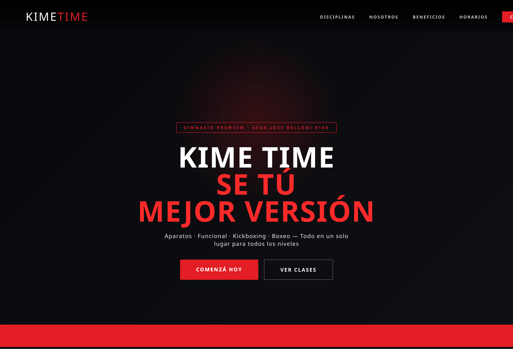
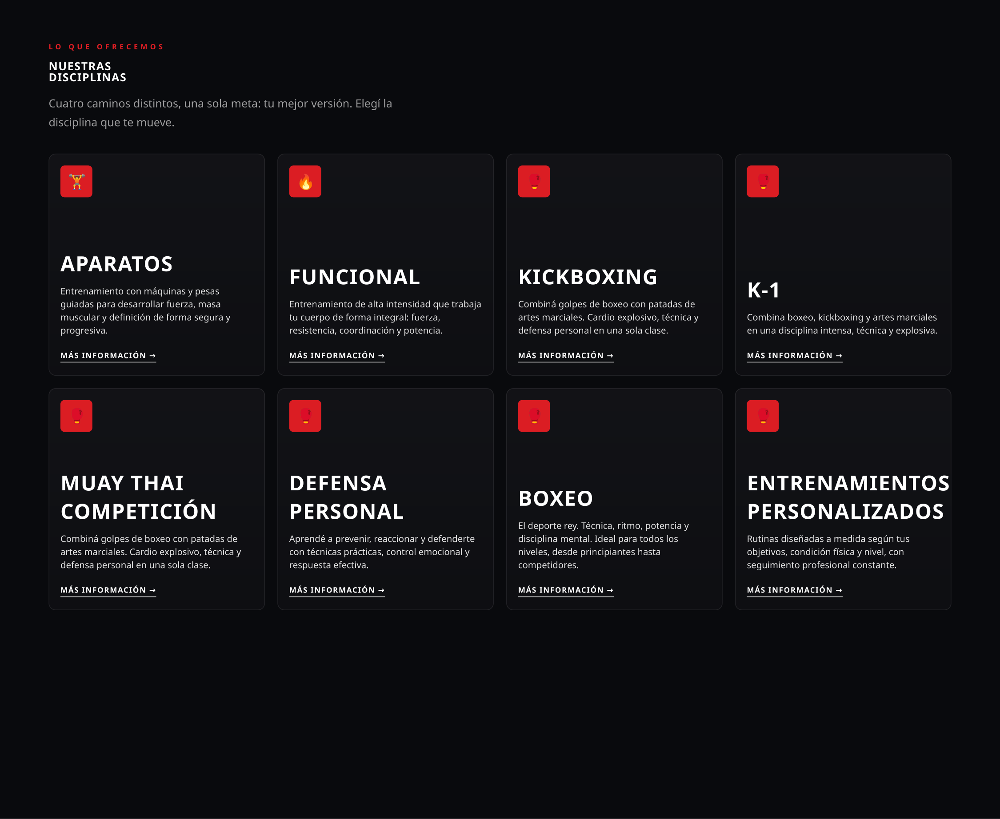
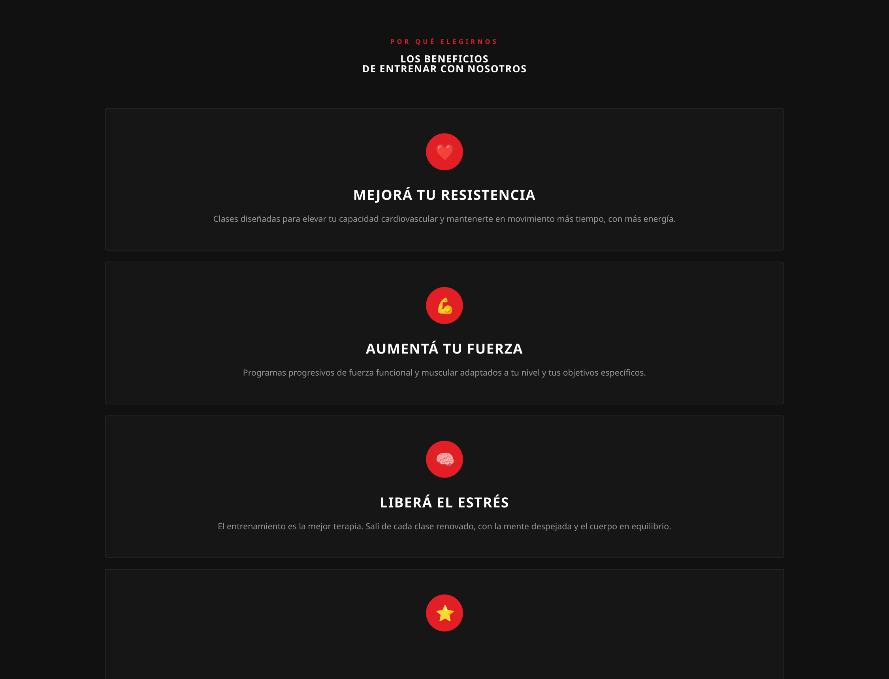
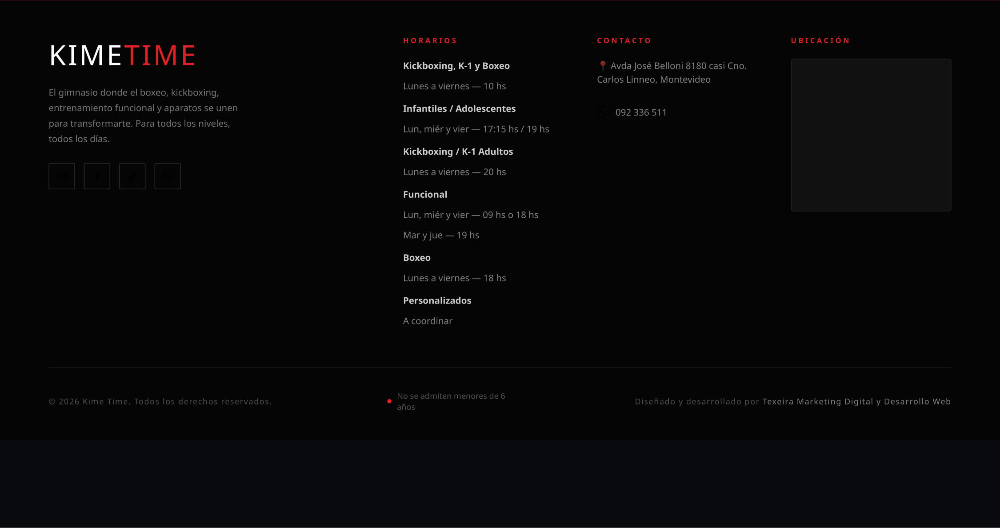
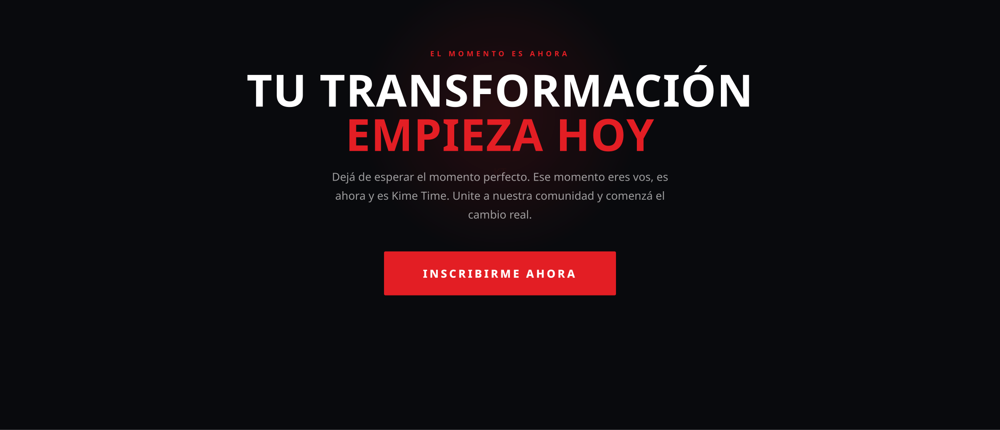

# Kime Time

Sitio web profesional desarrollado para **Kime Time**, gimnasio orientado a entrenamiento funcional, aparatos, boxeo, kickboxing y disciplinas de combate.

El proyecto fue diseñado como una landing page moderna, responsive y enfocada en conversión, con llamadas a la acción directas a WhatsApp y una experiencia visual adaptada a la identidad deportiva del gimnasio.

## Demo en vivo

**GitHub Pages:** https://diego21286.github.io/kimetime/

## Objetivo del proyecto

Crear una presencia digital moderna para el gimnasio que permita:

- Presentar claramente sus disciplinas y servicios.
- Comunicar horarios, beneficios e información del gimnasio.
- Facilitar el contacto mediante WhatsApp.
- Generar una experiencia visual enérgica y orientada al público fitness.
- Funcionar correctamente en computadoras, tablets y celulares.

## Funcionalidades destacadas

- Hero principal con llamadas a la acción.
- Navegación fija y menú responsive para dispositivos móviles.
- Sección de disciplinas deportivas.
- Presentación de beneficios y propuesta del gimnasio.
- Información de horarios.
- Botones de contacto directo mediante WhatsApp.
- Animaciones y efectos durante el desplazamiento.
- Diseño adaptable a diferentes tamaños de pantalla.
- Integración de Google Fonts.
- Configuración básica de SEO y Open Graph.
- `robots.txt` y `sitemap.xml` para indexación.

## Tecnologías

- HTML5
- CSS3
- JavaScript
- Responsive Web Design
- Google Fonts
- GitHub Pages

## Capturas del proyecto

### Portada



### Disciplinas



### Beneficios



### Horarios



### Contacto



## SEO

El proyecto incluye elementos básicos para mejorar su presencia en buscadores:

- Título SEO específico para Kime Time.
- Meta descripción.
- Palabras clave relacionadas con gimnasio y deportes de combate.
- Etiquetas Open Graph para compartir el sitio en redes sociales.
- Archivo `robots.txt`.
- Archivo `sitemap.xml`.

## Estructura del proyecto

```text
kimetime/
├── index.html
├── styles.css
├── script.js
├── robots.txt
├── sitemap.xml
├── googlefb904d09376376c6.html
├── docs/
│   └── images/
│       ├── portada.png
│       ├── disciplinas.png
│       ├── beneficios.png
│       ├── horarios.png
│       └── contacto.png
└── README.md
```

## Publicación

El sitio se encuentra desplegado mediante **GitHub Pages** desde la rama `main`.

## Autor

Desarrollado por **Diego Texeira**.
